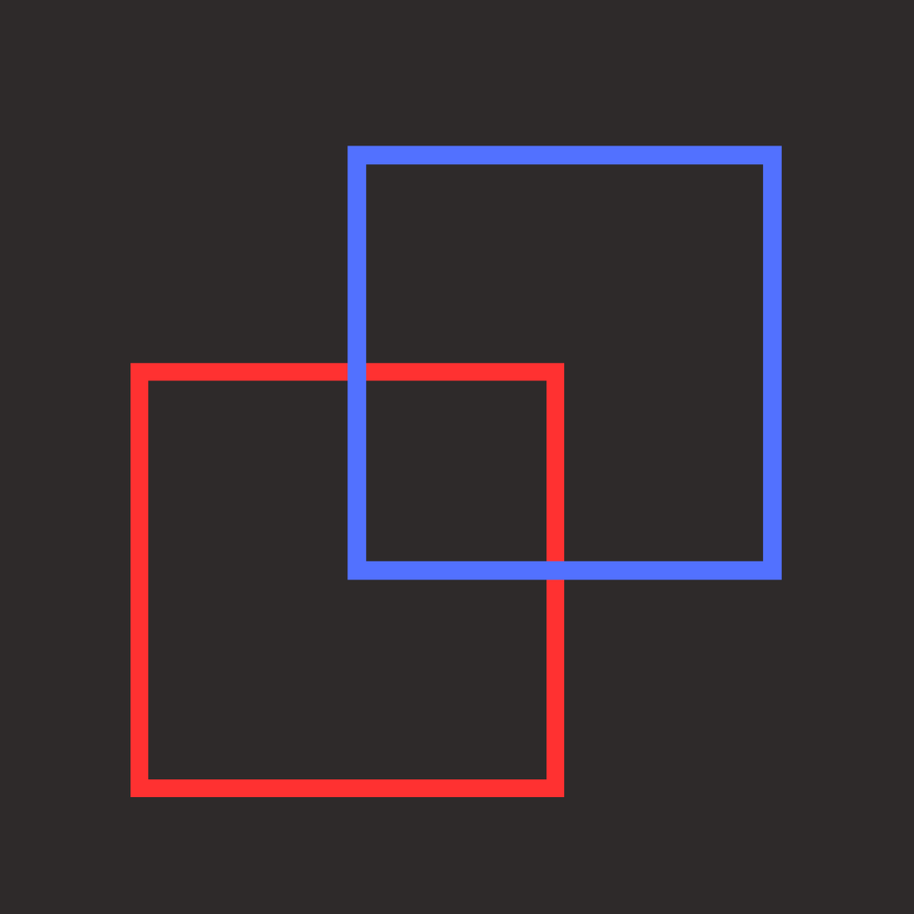

  
  <h1>Square Game</h1>

This game is a thrilling physics-based game developed using the Flutter framework. In this game, two squares collide with each other in a dynamic and engaging environment.

# :star2: Demo:

 
<video src="screenshots/demo.mp4"></video>

# :star2: Game Rules:
- The red and blue squares represent players, and with each collision, both players' sizes decrease.
- The purple square changes the direction and speed of the square randomly.
- The green square increases the size of the square.
- The game stops when one of the squares reaches a size of zero, indicating that the square has lost.

